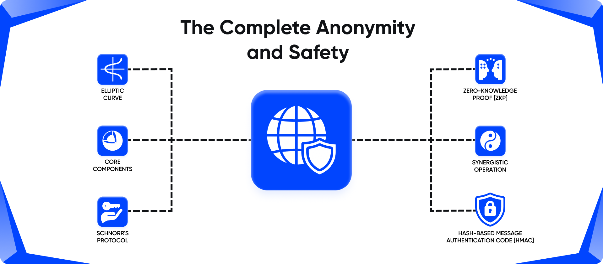
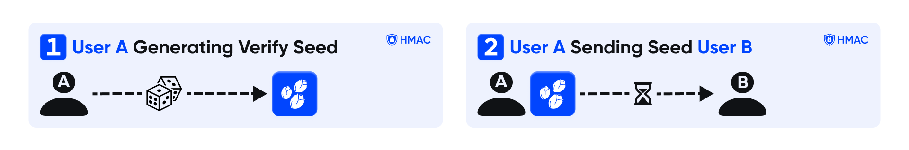
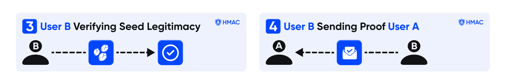
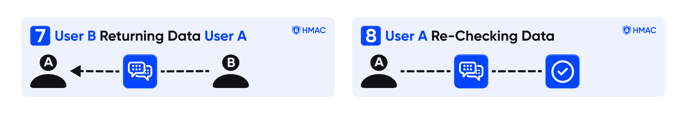
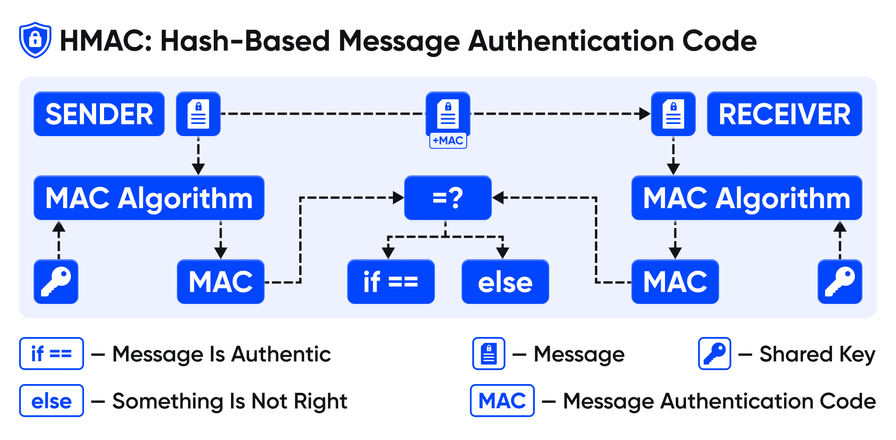

  

<h1 align="center">zk-Call & Labs</h1>

  <strong>"Zero-Knowledge" Proof Implementation with HMAC Communication in C++</strong>

 

  

  
    Built by <a href="https://github.com/zk-Call"> zk-Call</a> :)
  

 

## Table of Contents
- [Credits](#credits)
- [Purpose](#purpose)
- [How it Works](#how-it-works)
- [API](#api)
- [Example Usage](#example-usage)
 

# Credits

This repository hosts a refined implementation of [**Schnorr's protocol**](https://en.wikipedia.org/wiki/Schnorr_signature) , innovatively incorporating a state seed for enhanced security measures. While the underlying proofs may appear intricate, I aim to elucidate their functionality to the best of my ability. However, for a deeper understanding, I encourage referencing the seminal research papers underpinning this implementation, as they offer comprehensive insights.

---

 
 

**For further exploration:**

[**Elliptic Curve Based "Zero-Knowledge" Proofs and Their Applicability on Resource Constrained Devices by Ioannis Chatzigiannakis, Apostolos Pyrgelis, Paul G. Spirakis, and Yannis C. Stamatiou**](https://arxiv.org/pdf/1107.1626.pdf)

---

 

Additionally, this repository delves into the concepts of **"Zero-Knowledge" Proofs (ZKPs)** and **Hash-based Message Authentication Codes (HMACs)**. **ZKPs** are cryptographic protocols that allow one party **(the prover)** to prove to another party **(the verifier)** that a given statement is true, without revealing any additional information beyond the validity of the statement itself. This property is particularly valuable for preserving privacy while establishing trust.
 

On the other hand, **HMACs** are a type of cryptographic hash function used for message authentication. They involve a cryptographic hash function **(such as SHA-256)** and a secret cryptographic key. **HMACs** provide a way to verify both the data integrity and the authenticity of a message, ensuring that it has not been altered or tampered with during transmission and that it indeed originates from the purported sender.
 
 

# Purpose

In today's rapidly evolving IT and application development landscape, **"Zero-Knowledge" Proofs (ZKPs)** emerge as a pivotal paradigm for authentication security. Their capacity to affirm the validity of a claim, such as proving possession of a secret password — without revealing any sensitive information about the claim itself, such as passwords or hashes, revolutionizes the assurance of secure AAA operations (authentication, authorization, and accounting).

---

 

**zk-Call & Labs** represents an implementation of a [**Non-Interactive "Zero-Knowledge" Proof**](https://en.wikipedia.org/wiki/Non-interactive_zero-knowledge_proof) **(NIZKP)** protocol tailored specifically for validating text-based secrets. This framework proves invaluable for safeguarding passwords and other authentication mechanisms, ensuring robust security measures without compromising privacy. Additionally, the integration of **HMAC (Hash-Based Message Authentication Code)** further fortifies the authentication process, enhancing data integrity and thwarting potential security breaches.
 
 

# How It Works

The authentication protocol employed in this system operates based on two fundamental concepts:
**"Zero-Knowledge" Proofs (ZKPs)** and **Hash-Based Message Authentication Code (HMAC)**. Let's delve into each of these components and understand how they synergize to ensure secure authentication in messaging applications.
 

"Zero-Knowledge" Proofs (ZKPs)
---

#### **"Zero-Knowledge" Proofs (ZKPs):** 
**ZKPs** form the bedrock of privacy-preserving authentication mechanisms. These proofs allow one party **(the prover)** to demonstrate the validity of a claim to another party **(the verifier)** without revealing any additional information beyond the claim's validity. In essence, **ZKPs** enable authentication without the need for the prover to disclose sensitive data, such as passwords or cryptographic keys.

---

 

#### **Application in Authentication:** 
In the context of messaging applications, **ZKPs** play a pivotal role in verifying a user's identity without the need to transmit explicit credentials over the network. Instead, users can generate cryptographic proofs attesting to their identity or possession of certain credentials without exposing those credentials themselves. This ensures that sensitive information remains confidential during the authentication process, bolstering security and privacy.
 
 

Hash-Based Message Authentication Code (HMAC)
---

#### **Hash-Based Message Authentication Code (HMAC):**
**HMAC** provides a robust mechanism for verifying the integrity and authenticity of messages exchanged between parties. It involves the use of a cryptographic hash function in conjunction with a secret key to generate a unique code **(the HMAC)** for each message. This code serves as a digital signature, allowing the recipient to verify that the message has not been tampered with or altered during transmission.

---

#### **Application in Authentication:**
In messaging applications, **HMAC** can be employed to authenticate message senders and ensure the integrity of communication channels. By appending an **HMAC** to each message using a shared secret key, both the sender and recipient can validate the message's authenticity upon receipt. Any unauthorized modifications to the message would result in a mismatch between the **computed HMAC** and the **received HMAC**, thereby alerting the recipient to potential tampering.
 
 

Synergistic Operation:
---
When combined, **"Zero-Knowledge" Proofs** and **HMAC** create a formidable framework for secure authentication in messaging applications. **ZKPs** facilitate identity verification without divulging sensitive information, while **HMAC** ensures the integrity and authenticity of messages exchanged between parties. Together, these mechanisms uphold the confidentiality, integrity, and authenticity of communication channels, safeguarding users' privacy and security in the digital realm.

---

 
 

# API

The **`"HMAC_Client"`** С++ API is meant to be simple and intuitive:

## Core Components
The **`Core Components`** streamline secure **Message Encryption** and **Decryption**, supporting both **Chunk** and **Character-Level** processing for enhanced data protection.

---

#### HMAC_Client.encrypt_message_by_chunks:
Method to **encrypt a message** by processing it in **chunks**.

    std::string encrypt_message_by_chunks(const std::string& message);

        message: string                    # message: The message to be encrypted

#### HMAC_Client.encrypt_message:
Method to **encrypt a message** by a **chars**.

    std::string encrypt_message(const std::string& message);

        message: string                    # message: The char to be encrypted
#### HMAC_Client.decrypt_message_by_chunks:
Method to **decrypt a message** by processing it in **chunks**.

     std::string decrypt_message_by_chunks(const std::string& message);

        message: string                    # message: The message to be dencrypted

#### HMAC_Client.decrypt_message:
Method to **decrypt a message** by processing it in **chars**.

     std::string encrypt_message(const std::string& message);

        message: string                    # message: The char to be dencrypted

---

# Example Usage
TODO: Include **`Example Usage`**

## Example 1

    #include <iostream> // Include the input/output stream standard header
    #include <thread> // Include the thread standard header
    #include <queue> // Include the queue standard header
    #include <string> // Include the string standard header
    #include "src/HMAC/core/base.h" // Include the header file for HMAC_Client functionality
    #include "src/SeedGeneration/core/base.h" // Include the header file for SeedGenerator functionality
    
    constexpr bool DEBUG = true; // Define a constexpr boolean variable DEBUG with value true
    
    void print_msg(const std::string &who, const std::string &message) { // Define a function to print messages
    if (DEBUG) { // Check if debugging is enabled
    std::cout << "[" << who << "] " << message << std::endl; // Print the message with source identifier
        }
    }
    
    bool check_if_queue_empty(std::queue<std::string> &socket) { // Define a function to check if a queue is empty
    while (true) { // Infinite loop
    if (!socket.empty()) { // Check if the queue is not empty
    return true; // Return true if the queue is not empty
            }
        }
    }
    
    std::string get_content_from_socket(std::queue<std::string> &socket) { // Define a function to get content from a socket (queue)
    if (check_if_queue_empty(socket)) { // Check if the queue is not empty
    std::string val = socket.front(); // Get the front element of the queue
    socket.pop(); // Remove the front element from the queue
    return val; // Return the retrieved value
        }
    }
    
    void client(std::queue<std::string> &client_socket, std::queue<std::string> &server_socket) { // Define the client function
    // Generating the main seed
    SeedGenerator seed_generator("job"); // Create an instance of SeedGenerator
    std::vector<unsigned char> main_seed = seed_generator.generate(); // Generate the main seed
    
        // Creating an instance of HMAC_Client for encrypting messages
        print_msg("client", "first");
        HMAC_Client obj("sha256", main_seed, 1); // Create an instance of HMAC_Client
    
        // Sending the main seed to the server
        server_socket.emplace(main_seed.begin(), main_seed.end()); // Convert the main seed vector to a string and send it to the server
        print_msg("client", "after obj");
    
        // Checking if the server has successfully received the seed
        if (get_content_from_socket(client_socket) == obj.encrypt_message("")) { // Check if the server received the seed
            print_msg("client", "after if");
    
            // If successful, send a message to the server
            std::string message = "hello"; // Define the message to be sent
            server_socket.push(obj.encrypt_message_by_chunks(message)); // Encrypt and send the message to the server
            print_msg("client", "client sent message " + message);
    
            // Checking if the server has successfully decrypted the message
            if (get_content_from_socket(client_socket) == obj.encrypt_message(message)) { // Check if the server decrypted the message
                print_msg("client", "server has decrypted message");
            }
        }
    }
    
    void server(std::queue<std::string> &server_socket, std::queue<std::string> &client_socket) { // Define the server function
    // Receiving the main seed from the client
    std::string main_seed = get_content_from_socket(server_socket); // Receive the main seed from the client
    
        // Creating an instance of HMAC_Client for encrypting messages
        HMAC_Client obj("sha256", std::vector<unsigned char>(main_seed.begin(), main_seed.end()), 1); // Create an instance of HMAC_Client
    
        // Sending an empty message to the client as acknowledgment
        client_socket.push(obj.encrypt_message("")); // Encrypt and send an empty message to the client as acknowledgment
    
        // Receiving the encrypted message from the client
        std::string msg = get_content_from_socket(server_socket); // Receive the encrypted message from the client
        print_msg("server", "message encrypted: " + msg);
    
        // Decrypting the message
        print_msg("server", "before decrypt ");
        std::string msg_raw = obj.decrypt_message_by_chunks(msg); // Decrypt the received message
        print_msg("server", "message raw: " + msg_raw);
    
        // Sending the encrypted message back to the client
        client_socket.push(obj.encrypt_message(msg_raw)); // Encrypt and send the decrypted message back to the client
    }
    
    int main() { // Main function
    std::queue<std::string> client_socket, server_socket; // Create queues for client and server sockets
    std::thread client_thread(client, std::ref(client_socket), std::ref(server_socket)); // Create a thread for the client function
    std::thread server_thread(server, std::ref(server_socket), std::ref(client_socket)); // Create a thread for the server function
    
        // Joining the threads to wait for their completion
        client_thread.join(); // Wait for the client thread to finish
        server_thread.join(); // Wait for the server thread to finish
    
        return 0; // Return 0 to indicate successful execution
    }

---

## Example 2

    #include "src/ZeroKnowledge/core/base.h" // Include the header file for ZeroKnowledge class

    int main() { // Main function
    // Creating a ZeroKnowledge object for the client with specified curve and hash algorithm
    ZeroKnowledge clientObject = ZeroKnowledge::createNew("secp256k1", "sha3_256");
    
        // Creating a ZeroKnowledge object for the server with specified curve and hash algorithm
        ZeroKnowledge serverObject = ZeroKnowledge::createNew("secp384r1", "sha3_512");
    
        // Setting the server password
        std::string serverPassword = "SecretServerPassword";
    
        // Creating a signature for the server password
        ZeroKnowledgeSignature serverSignature = serverObject.createSignature(serverPassword);
    
        // Creating a signature for the client identity
        std::string identity = "John";
        ZeroKnowledgeSignature clientSignature = clientObject.createSignature(identity);
        std::cout<<"before\n";
    
        // Generating a token signed by the server for the client
        std::cout<<clientObject.token()<<"\n";
    
        ZeroKnowledgeData token = serverObject.sign(serverPassword, clientObject.token());
        std::cout<<"after\n";
    
        // Generating proof using client identity and token
        ZeroKnowledgeData proof = clientObject.sign(identity, token.data);
    
        // Verifying the received proof
        bool serverVerification = serverObject.verify(token, serverSignature);
        if (!serverVerification) { // Check if server verification failed
            std::cout << "Server verification failed" << std::endl; // Print error message
        } else { // If server verification succeeded
            // Otherwise, verify the proof using client signature
            bool clientVerification = clientObject.verify(token, clientSignature, proof.proof);
            if (!clientVerification) { // Check if client verification failed
                std::cout << "Client verification failed" << std::endl; // Print error message
            } else { // If client verification succeeded
                std::cout << "Authentication successful" << std::endl; // Print success message
            }
        }
    
        return 0; // Return 0 to indicate successful execution
    }

---

## Example 3

    #include "src/ZeroKnowledge/core/base.h" // Include the header file for ZeroKnowledge class
    #include "src/HMAC/core/base.h" // Include the header file for HMAC_Client functionality
    #include "src/SeedGeneration/core/base.h" // Include the header file for SeedGenerator functionality
    #include <iostream> // Include the input/output stream standard header
    #include <thread> // Include the thread standard header
    #include <queue> // Include the queue standard header
    #include <string> // Include the string standard header
    
    constexpr bool DEBUG = true; // Define a constexpr boolean variable DEBUG with value true
    
    void print_msg(const std::string &who, const std::string &message) { // Define a function to print messages
    if (DEBUG) { // Check if debugging is enabled
    std::cout << "[" << who << "] " << message << std::endl; // Print the message with source identifier
        }
    }
    
    bool check_if_queue_empty(std::queue<std::string> &socket) { // Define a function to check if a queue is empty
    while (true) { // Infinite loop
    if (!socket.empty()) { // Check if the queue is not empty
    return true; // Return true if the queue is not empty
            }
        }
    }
    
    std::string get_content_from_socket(std::queue<std::string> &socket) { // Define a function to get content from a socket (queue)
    if (check_if_queue_empty(socket)) { // Check if the queue is not empty
    std::string val = socket.front(); // Get the front element of the queue
    socket.pop(); // Remove the front element from the queue
    return val; // Return the retrieved value
        }
    }
    
    void client(std::queue<std::string> &client_socket, std::queue<std::string> &server_socket) { // Define the client function
    // Generating the main seed
    SeedGenerator seed_generator("job"); // Create an instance of SeedGenerator
    std::vector<unsigned char> main_seed = seed_generator.generate(); // Generate the main seed
    
        // Creating an instance of HMAC_Client for encrypting messages
        print_msg("client", "first");
        HMAC_Client obj("sha256", main_seed, 1); // Create an instance of HMAC_Client
    
        // Sending the main seed to the server
        server_socket.emplace(main_seed.begin(), main_seed.end()); // Convert the main seed vector to a string and send it to the server
        print_msg("client", "after obj");
    
        // Checking if the server has successfully received the seed
        if (get_content_from_socket(client_socket) == obj.encrypt_message("")) { // Check if the server received the seed
            print_msg("client", "after if");
    
            // If successful, send a message to the server
            std::string message = "hello"; // Define the message to be sent
            server_socket.push(obj.encrypt_message_by_chunks(message)); // Encrypt and send the message to the server
            print_msg("client", "client sent message " + message);
    
            // Checking if the server has successfully decrypted the message
            if (get_content_from_socket(client_socket) == obj.encrypt_message(message)) { // Check if the server decrypted the message
                print_msg("client", "server has decrypted message");
            }
        }
    }
    
    void server(std::queue<std::string> &server_socket, std::queue<std::string> &client_socket) { // Define the server function
    // Receiving the main seed from the client
    std::string main_seed = get_content_from_socket(server_socket); // Receive the main seed from the client
    
        // Creating an instance of HMAC_Client for encrypting messages
        HMAC_Client obj("sha256", std::vector<unsigned char>(main_seed.begin(), main_seed.end()), 1); // Create an instance of HMAC_Client
    
        // Sending an empty message to the client as acknowledgment
        client_socket.push(obj.encrypt_message("")); // Encrypt and send an empty message to the client as acknowledgment
    
        // Receiving the encrypted message from the client
        std::string msg = get_content_from_socket(server_socket); // Receive the encrypted message from the client
        print_msg("server", "message encrypted: " + msg);
    
        // Decrypting the message
        print_msg("server", "before decrypt ");
        std::string msg_raw = obj.decrypt_message_by_chunks(msg); // Decrypt the received message
        print_msg("server", "message raw: " + msg_raw);
    
        // Sending the encrypted message back to the client
        client_socket.push(obj.encrypt_message(msg_raw)); // Encrypt and send the decrypted message back to the client
    }
    
    void init_talking() { // Define a function to initialize client-server communication
    std::queue<std::string> client_socket, server_socket; // Create queues for client and server sockets
    std::thread client_thread(client, std::ref(client_socket), std::ref(server_socket)); // Create a thread for the client function
    std::thread server_thread(server, std::ref(server_socket), std::ref(client_socket)); // Create a thread for the server function
    
        // Joining the threads to wait for their completion
        client_thread.join(); // Wait for the client thread to finish
        server_thread.join(); // Wait for the server thread to finish
    }
    
    int main() { // Main function
    
        // Creating a ZeroKnowledge object for the client with specified curve and hash algorithm
        ZeroKnowledge clientObject = ZeroKnowledge::createNew("secp256k1", "sha3_256");
    
        // Creating a ZeroKnowledge object for the server with specified curve and hash algorithm
        ZeroKnowledge serverObject = ZeroKnowledge::createNew("secp384r1", "sha3_512");
    
        // Setting the server password
        std::string serverPassword = "SecretServerPassword";
    
        // Creating a signature for the server password
        ZeroKnowledgeSignature serverSignature = serverObject.createSignature(serverPassword);
    
        // Creating a signature for the client identity
        std::string identity = "John";
        ZeroKnowledgeSignature clientSignature = clientObject.createSignature(identity);
        std::cout << "before\n";
    
        // Generating a token signed by the server for the client
        std::cout << clientObject.token() << "\n";
    
        ZeroKnowledgeData token = serverObject.sign(serverPassword, clientObject.token());
        std::cout << "after\n";
    
        // Generating proof using client identity and token
        ZeroKnowledgeData proof = clientObject.sign(identity, token.data);
    
        // Verifying the received proof
        bool serverVerification = serverObject.verify(token, serverSignature);
        if (!serverVerification) { // Check if server verification failed
            std::cout << "Server verification failed" << std::endl; // Print error message
        } else { // If server verification succeeded
            // Otherwise, verify the proof using client signature
            bool clientVerification = clientObject.verify(token, clientSignature, proof.proof);
            if (!clientVerification) { // Check if client verification failed
                std::cout << "Client verification failed" << std::endl; // Print error message
            } else { // If client verification succeeded
                std::cout << "Authentication successful" << std::endl; // Print success message
                init_talking(); // Initialize client-server communication
    
            }
        }
    
        return 0; // Return 0 to indicate successful execution
    }
